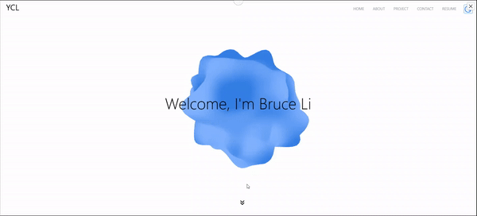

# Portfolio Website

Hi there! Welcome to my portfolio website, where I share my favorite projects and a little about myself. Built with Typescript, ReactJS, and Mantine, and powered by React Three Fiber for some cool 3D effects, this site showcases my work in a clean, straightforward manner. It’s hosted on Firebase, and I’ve used custom GLSL shaders to create dynamic visuals, like subtle light-blue gradients with Perlin noise for texture. Feel free to explore and check out what I’ve been working on!

